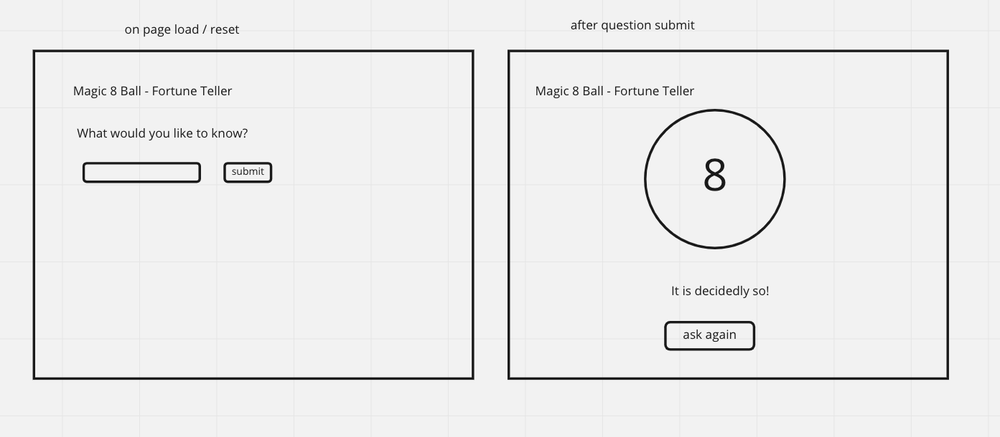

# Magic 8 ball Plan

## HTML

-   h1 for header
-   section with
    -   p tag for prompt
    -   button for submit
    -   text input for user question
-   section for
    -   img of 8 ball
    -   p tag to display the randomly selected answer
    -   button to ask again

## Events

-   button click (question submit)
    -   hide prompt
    -   display the image
    -   pick a randomw number between 0 and length of the answers array - 1
    -   set the content of the answer p to the random choice
-   button click (ask again)
    -   hide 8 ball and the answer
    -   show prompt
